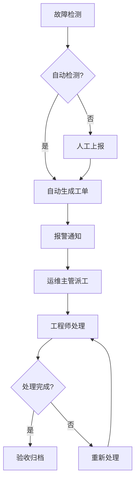

## 1. Product Overview
高速公路机电运维管理平台是一个智能化运维管理系统，通过对高速公路机电设备数据的智能采集与多源数据融合，实现设备故障自动检测、及时报警和快速处置，同时提供全生命周期资产管理、AI智能分析和运维知识库功能。

## 2. Core Features

### 2.1 User Roles
| Role | Registration Method | Core Permissions |
|------|---------------------|------------------|
| 管理员 | 系统配置 | 系统管理、用户管理、权限配置 |
| 运维主管 | 账号分配 | 设备管理、故障处理、人员派工 |
| 运维工程师 | 账号分配 | 故障处理、设备巡检、工单处理 |
| 数据分析员 | 账号分配 | 数据查询、报表生成、趋势分析 |

### 2.2 Feature Module
1. **仪表盘**: 实时监控、设备状态概览、报警统计
2. **故障管理**: 故障检测、报警通知、工单处理
3. **设备管理**: 设备台账、生命周期管理、维护记录
4. **人员管理**: 员工档案、工作派工、绩效考核
5. **备件管理**: 备品备件库存、出入库管理
6. **数据分析**: 趋势分析、报表生成、AI预测
7. **知识库**: 运维经验、故障案例、操作指南

### 2.3 Page Details
| Page Name | Module Name | Feature description |
|-----------|-------------|---------------------|
| Dashboard | 仪表盘 | 实时监控大屏、设备状态统计、报警概览 |
| Fault Management | 故障列表 | 故障查询、状态筛选、批量处理 |
| Fault Management | 故障详情 | 故障信息、处理流程、历史记录 |
| Device Management | 设备台账 | 设备列表、分类管理、详情查看 |
| Device Management | 设备详情 | 设备信息、维护记录、生命周期 |
| Personnel Management | 员工管理 | 员工列表、角色分配、考勤统计 |
| Personnel Management | 派工管理 | 工单分配、任务调度、进度跟踪 |
| Spare Parts | 备件库存 | 库存列表、预警提醒、出入库记录 |
| Analytics | 数据分析 | 趋势图表、报表生成、AI预测 |
| Knowledge Base | 知识库 | 文档管理、案例搜索、经验分享 |

## 3. Core Process

### 故障处理流程
用户上报或系统检测到故障 → 自动生成工单 → 运维主管派工 → 工程师处理 → 验收完成 → 归档

### 设备生命周期管理流程
设备入库 → 安装使用 → 定期维护 → 故障维修 → 报废处置

## 4. User Interface Design

### 4.1 Design Style
- **Primary Color**: #1E40AF (深蓝色系，体现专业可靠)
- **Secondary Color**: #059669 (绿色系，象征安全与生命力)
- **Accent Color**: #F59E0B (橙色系，用于警示和重点强调)
- **Button Style**: 圆角矩形，hover状态有阴影效果
- **Font**: 思源黑体/Inter，清晰易读
- **Layout**: 左侧导航 + 右侧内容区域，卡片式布局
- **Icon Style**: 简洁现代的线性图标

### 4.2 Page Design Overview
| Page Name | Module Name | UI Elements |
|-----------|-------------|-------------|
| Dashboard | 监控大屏 | 数据卡片、实时图表、告警横幅、快速入口 |
| Fault Management | 故障列表 | 表格展示、状态标签、筛选器、操作按钮 |
| Device Management | 设备台账 | 卡片网格、分类标签、搜索框、批量操作 |
| Analytics | 数据分析 | 多维度图表、时间筛选、数据导出 |

### 4.3 Responsiveness
- Desktop-first 设计，支持1920x1080及更高分辨率
- 响应式布局，适配不同屏幕尺寸
- 移动端适配，触控友好的交互元素