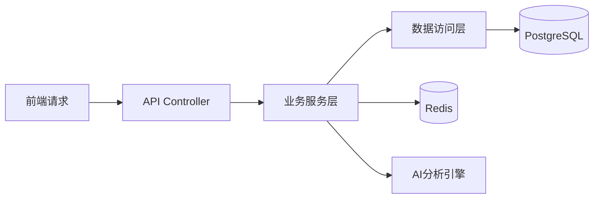
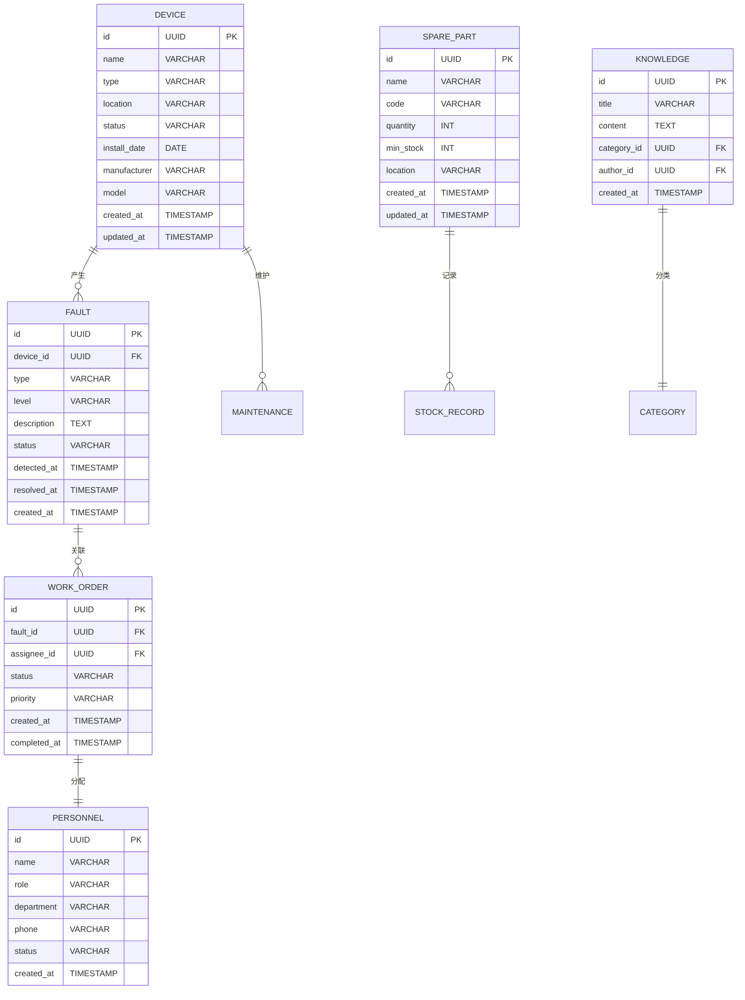

## 1. Architecture Design

```mermaid
layeredGraph LR
    subgraph Frontend[React Frontend]
        Dashboard[仪表盘]
        Fault[故障管理]
        Device[设备管理]
        Personnel[人员管理]
        Spare[备件管理]
        Analytics[数据分析]
        Knowledge[知识库]
    end
    
    subgraph Backend[Express Backend]
        API[RESTful API]
        Service[业务逻辑层]
        AI[AI分析模块]
    end
    
    subgraph Data[Database]
        PostgreSQL[(PostgreSQL)]
        Redis[(Redis缓存)]
    end
    
    subgraph External[外部服务]
        Supabase[Supabase Auth]
        MQTT[MQTT消息队列]
    end
    
    Frontend --> API
    API --> Service
    Service --> PostgreSQL
    Service --> Redis
    Service --> AI
    API --> Supabase
    Service --> MQTT
```

## 2. Technology Description
- **Frontend**: React@18 + TypeScript + TailwindCSS@3 + Vite
- **Backend**: Express@4 + TypeScript
- **Database**: PostgreSQL (主库) + Redis (缓存)
- **Authentication**: Supabase Auth
- **Real-time**: MQTT for设备数据推送
- **Charting**: ECharts/Recharts
- **State Management**: Zustand

## 3. Route Definitions
| Route | Purpose |
|-------|---------|
| / | 仪表盘首页 |
| /faults | 故障列表页 |
| /faults/:id | 故障详情页 |
| /devices | 设备台账页 |
| /devices/:id | 设备详情页 |
| /personnel | 人员管理页 |
| /personnel/scheduling | 派工管理页 |
| /spare-parts | 备件管理页 |
| /analytics | 数据分析页 |
| /knowledge | 知识库页 |
| /settings | 系统设置页 |

## 4. API Definitions

### 4.1 故障管理API
| Method | Endpoint | Description |
|--------|----------|-------------|
| GET | /api/faults | 获取故障列表 |
| GET | /api/faults/:id | 获取故障详情 |
| POST | /api/faults | 创建故障工单 |
| PUT | /api/faults/:id | 更新故障状态 |
| DELETE | /api/faults/:id | 删除故障记录 |

### 4.2 设备管理API
| Method | Endpoint | Description |
|--------|----------|-------------|
| GET | /api/devices | 获取设备列表 |
| GET | /api/devices/:id | 获取设备详情 |
| POST | /api/devices | 添加新设备 |
| PUT | /api/devices/:id | 更新设备信息 |
| DELETE | /api/devices/:id | 删除设备 |

### 4.3 人员管理API
| Method | Endpoint | Description |
|--------|----------|-------------|
| GET | /api/personnel | 获取员工列表 |
| GET | /api/personnel/:id | 获取员工详情 |
| POST | /api/personnel | 添加员工 |
| PUT | /api/personnel/:id | 更新员工信息 |

### 4.4 备件管理API
| Method | Endpoint | Description |
|--------|----------|-------------|
| GET | /api/spare-parts | 获取备件列表 |
| POST | /api/spare-parts/stock-in | 入库操作 |
| POST | /api/spare-parts/stock-out | 出库操作 |

### 4.5 数据分析API
| Method | Endpoint | Description |
|--------|----------|-------------|
| GET | /api/analytics/fault-trend | 故障趋势分析 |
| GET | /api/analytics/device-health | 设备健康度 |
| GET | /api/analytics/work-efficiency | 工作效率统计 |

## 5. Server Architecture Diagram



## 6. Data Model

### 6.1 Data Model Definition



### 6.2 Data Definition Language

```sql
CREATE TABLE devices (
    id UUID PRIMARY KEY DEFAULT gen_random_uuid(),
    name VARCHAR(255) NOT NULL,
    type VARCHAR(100),
    location VARCHAR(255),
    status VARCHAR(50) DEFAULT 'normal',
    install_date DATE,
    manufacturer VARCHAR(255),
    model VARCHAR(100),
    created_at TIMESTAMP DEFAULT CURRENT_TIMESTAMP,
    updated_at TIMESTAMP DEFAULT CURRENT_TIMESTAMP
);

CREATE TABLE faults (
    id UUID PRIMARY KEY DEFAULT gen_random_uuid(),
    device_id UUID REFERENCES devices(id),
    type VARCHAR(100),
    level VARCHAR(50) DEFAULT 'medium',
    description TEXT,
    status VARCHAR(50) DEFAULT 'pending',
    detected_at TIMESTAMP DEFAULT CURRENT_TIMESTAMP,
    resolved_at TIMESTAMP,
    created_at TIMESTAMP DEFAULT CURRENT_TIMESTAMP
);

CREATE TABLE work_orders (
    id UUID PRIMARY KEY DEFAULT gen_random_uuid(),
    fault_id UUID REFERENCES faults(id),
    assignee_id UUID REFERENCES personnel(id),
    status VARCHAR(50) DEFAULT 'pending',
    priority VARCHAR(50) DEFAULT 'normal',
    created_at TIMESTAMP DEFAULT CURRENT_TIMESTAMP,
    completed_at TIMESTAMP
);

CREATE TABLE personnel (
    id UUID PRIMARY KEY DEFAULT gen_random_uuid(),
    name VARCHAR(255) NOT NULL,
    role VARCHAR(50),
    department VARCHAR(100),
    phone VARCHAR(20),
    status VARCHAR(50) DEFAULT 'active',
    created_at TIMESTAMP DEFAULT CURRENT_TIMESTAMP
);

CREATE TABLE spare_parts (
    id UUID PRIMARY KEY DEFAULT gen_random_uuid(),
    name VARCHAR(255) NOT NULL,
    code VARCHAR(100) UNIQUE,
    quantity INT DEFAULT 0,
    min_stock INT DEFAULT 10,
    location VARCHAR(255),
    created_at TIMESTAMP DEFAULT CURRENT_TIMESTAMP,
    updated_at TIMESTAMP DEFAULT CURRENT_TIMESTAMP
);

CREATE TABLE knowledge (
    id UUID PRIMARY KEY DEFAULT gen_random_uuid(),
    title VARCHAR(255) NOT NULL,
    content TEXT,
    category_id UUID REFERENCES categories(id),
    author_id UUID REFERENCES personnel(id),
    created_at TIMESTAMP DEFAULT CURRENT_TIMESTAMP
);

CREATE TABLE categories (
    id UUID PRIMARY KEY DEFAULT gen_random_uuid(),
    name VARCHAR(100) NOT NULL,
    parent_id UUID REFERENCES categories(id),
    created_at TIMESTAMP DEFAULT CURRENT_TIMESTAMP
);
```